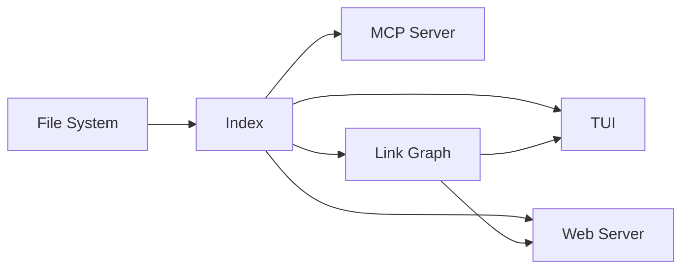

# Architecture Overview

## Components

### TUI Mode
Built with [Bubble Tea](https://github.com/charmbracelet/bubbletea). Split-pane layout with fuzzy file search, markdown rendering via Glamour, and syntax highlighting via Chroma.

### Web Mode
Stdlib `net/http` server with Goldmark for markdown rendering. SSE-based live reload, security headers, ETag caching.

### MCP Server
Model Context Protocol server exposing the document index as tools for AI agents.

## Data Flow

## Link Graph

The bidirectional link graph tracks forward links and backlinks between markdown files. Supports both standard `[text](target)` and `[[wikilink]]` syntax.

See the [quickstart guide](quickstart.md) for usage instructions.
