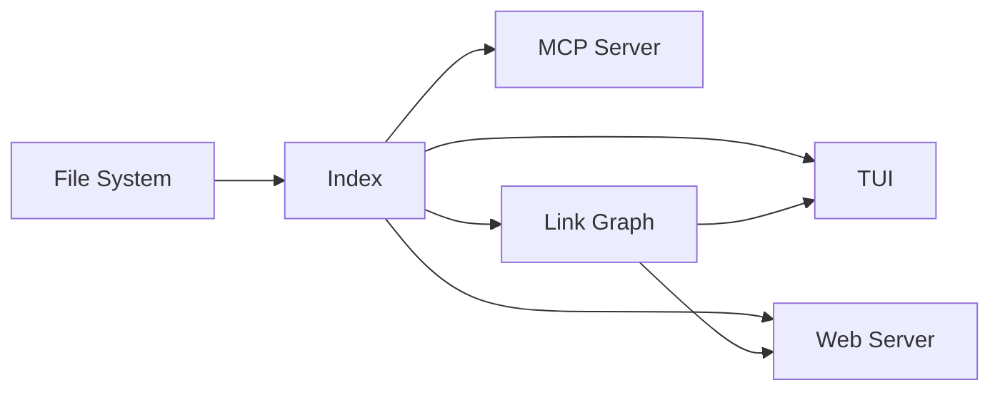

# Architecture Overview

## Components

### TUI Mode
Built with Bubble Tea. Split-pane layout with fuzzy file search, markdown rendering via Glamour, and syntax highlighting via Chroma.

### Web Mode
Stdlib `net/http` server with Goldmark for markdown rendering. SSE-based live reload, security headers, ETag caching.

### MCP Server
Model Context Protocol server exposing the document index as tools for AI agents.

## Data Flow

## Link Graph

The bidirectional link graph tracks forward links and backlinks between markdown files. Both standard and wiki-style syntax are supported.

See the [quickstart guide](quickstart.md) and the [API reference](api.md) for more.

## Roadmap

Upcoming work is tracked in the [design notes](design-notes.md) — not yet published, deliberately left as a broken link to showcase the health check.
